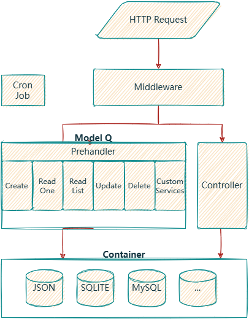

# Architecture

This is the structure of DYAPI. To learn how to creating and customing them, please refer to the [Developing Reference](/developing/). To know how to deal with the data, continue reading the guide.

## Container
A container represent a database. It wraps the structure of its database and SQLs, exposing create, read, update and delete functions. The following containers are provided by us, which can be found in `/dyapi/`:
- JSON Container
- Sqlite Container
- MySQL Container

## Model
A model represents a collection of items. It is a bridge between a container and API interface. It also defines the permission of the model and each field. It automatically generates the CRUD API interface on the URL `/api/{model_name}/`, whose behavior can be customized by adding `prehandlers`.

## Field
A field is a property of any item in a model. It has its own permission. Validation rules and processors can also be defined.

## Controller
A controller defines an activity. If we analogy a Model to a Noun, a Controller is a Verb. It also automatically generates an API endpoint.

## Service
A service is "controller under model". It also has its endpoint, but you can visit the model and check permission more conveniently than controller.

## Middleware
A middleware is a function that runs before & after every route. It can be used to check permission, or to modify the request body. An antispider middleware and a user permission middleware is integrated to the framework.